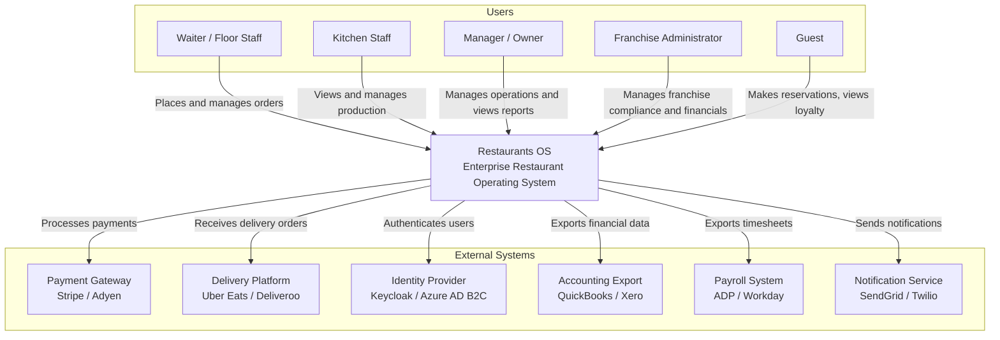

# System Context — Restaurants OS (C4 Level 1)

| Field              | Value |
|--------------------|-------|
| **Purpose**        | Define the C4 Level 1 system context — what Restaurants OS is and who/what interacts with it |
| **Scope**          | System boundary and all external actors |
| **Status**         | Draft |
| **Owner**          | Principal Architect |
| **Assumptions**    | External systems are integrated via APIs or events; not owned by Restaurants OS |
| **Constraints**    | Diagram is text-based (Mermaid); no image-only diagrams |
| **Risks**          | External system boundaries not clearly agreed; leads to unclear ownership |
| **References**     | C4 Model (Simon Brown), [Container View](05-container-view.md) |
| **Related Documents** | [Architecture Drivers](03-architecture-drivers.md), [Integration Patterns](../05-api/INTEGRATION_PATTERNS.md) |

---

## System Context Diagram

---

## External Actor Descriptions

| Actor | Type | Interaction |
|---|---|---|
| Waiter / Floor Staff | Human | Order entry, table management, payment |
| Kitchen Staff | Human | Production tracking via KDS |
| Manager / Owner | Human | Reporting, configuration, financial oversight |
| Franchise Administrator | Human | Franchise management, brand compliance, royalties |
| Guest | Human | Reservations, loyalty (via web/app — future) |
| Payment Gateway | External System | Payment authorization and settlement |
| Delivery Platform | External System | Receives and sends delivery orders |
| Identity Provider | External System | User authentication (OIDC/OAuth2) |
| Accounting Export | External System | Financial data export for external accounting tools |
| Payroll System | External System | Staff timesheet and payroll data export |
| Notification Service | External System | Email, SMS, push notification delivery |

---

## Revision History

| Date | Author | Change |
|---|---|---|
| 2026-07-08 | Principal Architect | Initial system context diagram |
