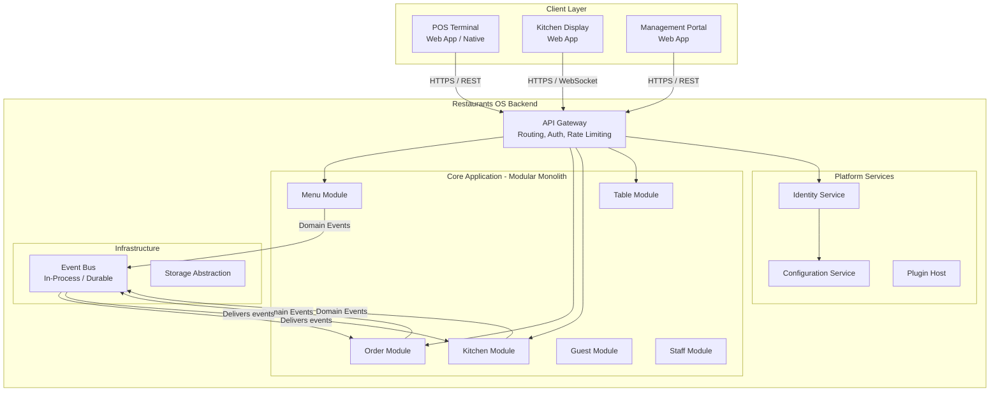

# Container View — Restaurants OS (C4 Level 2)

| Field              | Value |
|--------------------|-------|
| **Purpose**        | Define the C4 Level 2 container view — the major deployable units and their responsibilities |
| **Scope**          | All containers within Restaurants OS at Phase 1-2 (Modular Monolith) |
| **Status**         | Draft |
| **Owner**          | Principal Architect |
| **Assumptions**    | Phase 1 target is a Modular Monolith; this view shows module decomposition within it |
| **Constraints**    | Diagram is text-based; Mermaid |
| **Risks**          | Container boundaries become implicit coupling points if not clearly defined |
| **References**     | C4 Model, [System Context](04-system-context.md), [Evolution Roadmap](09-evolution-roadmap.md) |
| **Related Documents** | [Component View](06-component-view.md), [Deployment View](08-deployment-view.md) |

---

## Container Diagram (Phase 1 — Modular Monolith)

---

## Container Descriptions

| Container | Technology (TBD) | Responsibility |
|---|---|---|
| API Gateway | TBD (Kong / YARP / Envoy) | Request routing, authentication, rate limiting |
| Menu Module | TBD | Menu lifecycle management |
| Order Module | TBD | Order lifecycle management |
| Kitchen Module | TBD | Production tracking, KDS routing |
| Table Module | TBD | Floor plan, occupancy |
| Identity Service | Keycloak / Azure AD B2C | Authentication, authorization |
| Config Service | TBD | Per-tenant/branch configuration |
| Plugin Host | Custom | Plugin lifecycle management |
| Event Bus | In-process (Phase 1) → Durable (Phase 3) | Domain event distribution |

---

## Revision History

| Date | Author | Change |
|---|---|---|
| 2026-07-08 | Principal Architect | Initial container view for Phase 1 |
