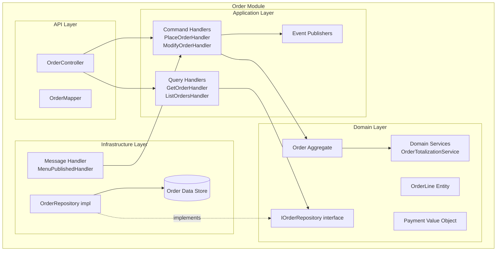

# Component View — Restaurants OS (C4 Level 3)

| Field              | Value |
|--------------------|-------|
| **Purpose**        | Define the C4 Level 3 component view — internal structure of key modules |
| **Scope**          | Order Module (as representative example); other modules follow the same pattern |
| **Status**         | Draft |
| **Owner**          | Principal Architect |
| **Assumptions**    | Clean Architecture layers are consistent across all modules |
| **Constraints**    | All modules follow the same layering: API → Application → Domain → Infrastructure |
| **Risks**          | Inconsistent layering between modules |
| **References**     | Clean Architecture (Martin), [Architecture Principles](00-architecture-principles.md) |
| **Related Documents** | [Container View](05-container-view.md), [ADR-0002](../../adr/strategic/ADR-0002-ddd-and-clean-architecture.md) |

---

## Standard Module Structure (Order Module Example)

---

## Layer Responsibilities

| Layer | Responsibility | Dependencies |
|---|---|---|
| **API** | HTTP request/response mapping; authentication enforcement | Application Layer only |
| **Application** | Use case orchestration; command/query dispatch; event publishing | Domain Layer |
| **Domain** | Business rules; aggregates; invariants; domain events; domain services | None (pure) |
| **Infrastructure** | Persistence; messaging; external integrations; repository implementations | Application + Domain interfaces |

---

## Revision History

| Date | Author | Change |
|---|---|---|
| 2026-07-08 | Principal Architect | Initial component view — Order Module as pattern |
